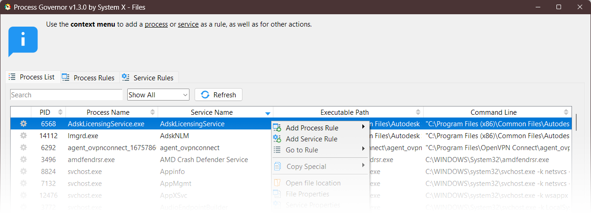
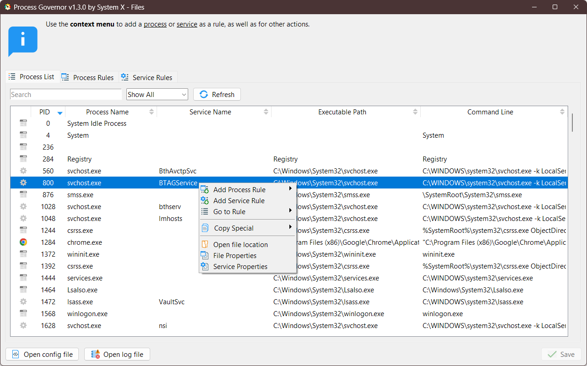
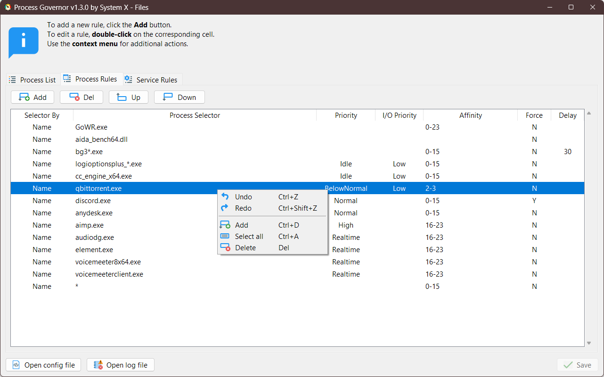
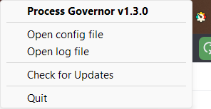

[![Contributors][contributors-shield]][contributors-url]
[![Forks][forks-shield]][forks-url]
[![Stargazers][stars-shield]][stars-url]
[![Issues][issues-shield]][issues-url]
[![License][license-shield]][license-url]

 

  

<h3 align="center">Process Governor</h3>

  

    A utility to automate Windows process and service management.
     
    <a href="#documentation"><strong>Explore the docs »</strong></a>
     
     
    <a href="https://github.com/SystemXFiles/process-governor/issues/new?labels=bug&template=bug-report.md">Report Bug</a>
    ·
    <a href="https://github.com/SystemXFiles/process-governor/issues/new?labels=enhancement&template=feature-request.md">Request Feature</a>
  

  
Table of Contents

  <ol>
    <li><a href="#about-the-project">About The Project</a></li>
    <li><a href="#getting-started">Getting Started</a></li>
    <li><a href="#documentation">Documentation</a></li>
    <li><a href="#star-history">Star History</a></li>
    <li><a href="#license">License</a></li>
  </ol>

## About The Project

   

**Process Governor** is a Python utility that automates the management of Windows processes and services by adjusting
their priorities, I/O priorities, and core affinity according to user-defined rules.

### Features

- Adjust process and service priorities for better performance.
- Control I/O priorities to optimize resource utilization.
- Define core affinity for processes.
- Fine-tune Windows services and processes based on user-defined rules.

### Screenshots

    
Click to expand

> 
>
> 
>
> 

(<a href="#document-top">back to top</a>)

## Getting Started

To get started with **Process Governor**, follow these steps:

1. Download the latest ready-to-use build from the following
   link: [Latest Release](https://github.com/SystemXFiles/process-governor/releases/latest).
2. Run the `Process Governor.exe` executable with **administrative privileges**.
3. Configure the rules for processes and services.
4. **Optionally**, enable auto-start for the program to launch automatically with the system.

You can close the program by accessing the tray icon.

(<a href="#document-top">back to top</a>)

## Documentation

- [Process Governor UI](ui_process_governor.md)
- [Rule Behavior and Tips](rule_behavior_and_tips.md)
- [Configuration file](configuration_file.md)
- [Running from source and creating a portable build](run_and_build.md)

(<a href="#document-top">back to top</a>)

## Star History

(<a href="#document-top">back to top</a>)

## License

This project is licensed under the GNU General Public License v3.0 - see the [LICENSE](../LICENSE) file for details.

(<a href="#document-top">back to top</a>)

<!-- MARKDOWN LINKS & IMAGES -->

[contributors-shield]: https://img.shields.io/github/contributors/SystemXFiles/process-governor.svg?style=for-the-badge

[contributors-url]: https://github.com/SystemXFiles/process-governor/graphs/contributors

[forks-shield]: https://img.shields.io/github/forks/SystemXFiles/process-governor.svg?style=for-the-badge

[forks-url]: https://github.com/SystemXFiles/process-governor/network/members

[stars-shield]: https://img.shields.io/github/stars/SystemXFiles/process-governor.svg?style=for-the-badge

[stars-url]: https://github.com/SystemXFiles/process-governor/stargazers

[issues-shield]: https://img.shields.io/github/issues/SystemXFiles/process-governor.svg?style=for-the-badge

[issues-url]: https://github.com/SystemXFiles/process-governor/issues

[license-shield]: https://img.shields.io/github/license/SystemXFiles/process-governor.svg?style=for-the-badge

[license-url]: https://github.com/SystemXFiles/process-governor/blob/master/LICENSE