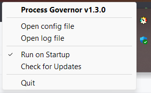

---

**Process Governor** is a Python utility designed to manage Windows processes and services by adjusting their
priorities, I/O priorities, and core affinity based on user-defined rules.

### Features

- Adjust process and service priorities for better performance.
- Control I/O priorities to optimize resource utilization.
- Define core affinity for processes.
- Fine-tune Windows services and processes based on user-defined rules.

### Screenshots

    
Click to expand

> 
>
> 
>
> 

## Getting started

To get started with **Process Governor**, follow these steps:

1. Download the latest ready-to-use build from the following
   link: [Latest Release](https://github.com/SystemXFiles/process-governor/releases/latest).
2. Run the `Process Governor.exe` executable with **administrative privileges**.
   This is important to allow the program to make the necessary adjustments to process and service priorities, I/O
   priorities, and core affinity.
3. Configure the rules for processes and services.
4. **Optionally**, you can enable auto-start for the program to launch automatically with
   the system.

You can close the program by accessing the tray icon.

## Knowledge base

- [Process Governor UI](ui_process_governor.md)
- [Rule Behavior and Tips](rule_behavior_and_tips.md)
- [Configuration file](configuration_file.md)
- [Running from source and creating a portable build](run_and_build.md)

## License

This project is licensed under the GNU General Public License v3.0 - see the [LICENSE](../LICENSE) file for details.