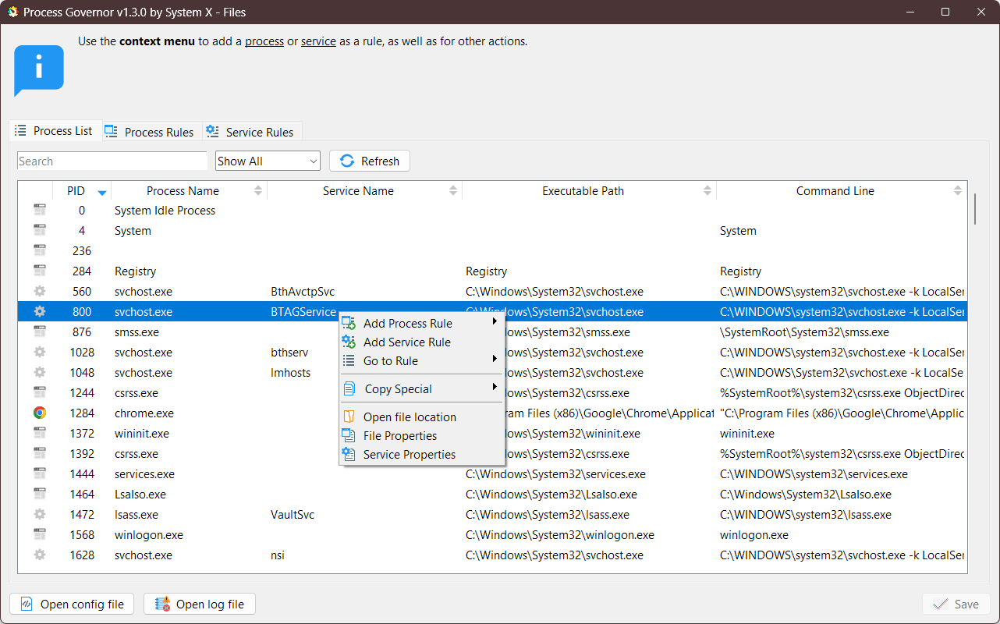

# Process Governor UI

[ README](README.md#documentation)

## Table of Contents

1. [System Tray](#system-tray)
2. [Main Window](#main-window)
3. [Process List](#process-list)
4. [Rule Lists](#rule-lists)
    - [Process Rules](#process-rules)
    - [Service Rules](#service-rules)
    - [Managing Rules](#managing-rules)
    - [Rules List Context Menu](#rules-list-context-menu)
    - [Editing Rules](#editing-rules)
    - [Error Handling](#error-handling)

## System Tray

The system tray menu provides quick access to the main program functions:

- **Process Governor**: Open settings.
- **Open config file**: Open the configuration file for manual settings editing.
- **Open log file**: Open the log file with the program's operation records.
- **Run on Startup**: Enable or disable program startup with the system.
- **Check for Updates**: Check for program updates.
- **Quit**: Exit the program.

(<a href="#document-top">back to top</a>)

## Main Window

### Tooltips

- In the settings interface, tooltips are available, describing the functions of buttons and fields.
- Hover over an interface element to view its tooltip.

(<a href="#document-top">back to top</a>)

### Action Buttons

Main action buttons are available in the settings interface:

- **Open config file**: Open the configuration file.
- **Open log file**: Open the log file.
- **Save**: Save changes made to the settings.  
  Hotkey: **Ctrl+S**.  
  **Details:**
    - The button is disabled if there are errors in the settings.
    - If no changes have been made, the save button is also disabled.

(<a href="#document-top">back to top</a>)

### Unsaved Changes Status

Unsaved changes are marked with an asterisk (`*`) on the corresponding rule tab.

(<a href="#document-top">back to top</a>)

## Process List

The process list provides important information about running processes:

- **PID**: Unique process identifier.
- **Process Name**: Name of the process.
- **Service Name**: Name of the service, if applicable.
- **Executable Path**: Full path to the executable file.
- **Command Line**: Command with which the process was started.

(<a href="#document-top">back to top</a>)

### Filtering and Search

- **Search**: Enter text into the search bar to find processes by name or other attributes (e.g., command line).
  Hotkey: **Ctrl+F**.

- **Filter by type**: Use the filter to display processes by type:
    - **Show All**: Display all processes.
    - **Show Processes**: Display only processes.
    - **Show Services**: Display only services.

- **Refresh**: Refresh the process list.  
  Hotkey: **F5**.

(<a href="#document-top">back to top</a>)

### Process Context Menu

- **Add Process Rule**: Add a rule for a process by name, path, or command line.
- **Add Service Rule**: Add a rule for a service by name.
- **Go to Rule**: Go to the existing rule for a process/service.
- **Copy Special**: Copy process attributes (PID, process name, etc.).
- **Open file location**: Open the folder containing the process’s executable file.
- **File Properties**: Open file properties.
- **Service Properties**: Open service properties.

(<a href="#document-top">back to top</a>)

## Rule Lists

The rule lists are divided into two categories: **Process Rules** and **Service Rules**.

### Process Rules

- **Selector By**: Determines how the **Process Selector** value is interpreted for process matching:
    - `Name` — by process name (e.g., `notepad.exe`).
    - `Path` — by the full executable path (e.g., `C:/Windows/System32/notepad.exe`).
    - `Command line` — by command line arguments (e.g., `App.exe Document.txt` or `D:/Folder/App.exe Document.txt`).

- **Process Selector**: Specifies the name, pattern, or path to the process.  
  **Supported wildcards:**
    - `*` — matches any number of characters.
    - `?` — matches a single character.
    - `**` — matches any sequence of directories.  
      **Examples:** `name.exe`, `logioptionsplus_*.exe`, `D:/FolderName/App.exe`,
      or `C:/Program Files/**/app.exe --file Document.txt`.

- **Priority**: Sets the priority level of the process.

- **I/O Priority**: Sets the I/O priority of the process.

- **Affinity**: Sets the CPU core affinity for the process.  
  **Formats:**
    - Range: `0-3`,
    - Specific cores: `0;2;4`,
    - Combination: `1;3-5`.

- **Force**: Forces the application of the settings.  
  **Possible values:**
    - `Y` — for continuous application,
    - `N` — for one-time application.

- **Delay**: Delay in seconds before applying the settings.  
  **Possible values:**
    - If not specified, the settings are applied immediately.
    - Positive values set a delay in seconds before applying the settings.

(<a href="#document-top">back to top</a>)

### Service Rules

- **Service Selector**: Specifies the name or pattern of the service to match.  
  **Supported wildcards:**
    - `*`: Matches any number of characters.
    - `?`: Matches a single character.

  **Examples:**
    - `"selector": "ServiceName"`
    - `"selector": "*audio*"`

Other parameters such as **Priority**, **I/O Priority**, **Affinity**, **Force**, and **Delay** are similar to those in
**Process Rules**.
> [!TIP]  
> The **Selector By** field is not used in **Service Rules** since services are matched only by name.

(<a href="#document-top">back to top</a>)

### Managing Rules

- **Add**: Add a new rule.
- **Del**: Delete the selected rules.
- **Up/Down**: Move the selected rule up or down in the rule list.

(<a href="#document-top">back to top</a>)

### Rules List Context Menu

- **Undo**: Undo the last action.  
  Hotkey: **Ctrl+Z**.

- **Redo**: Redo the undone action.  
  Hotkeys: **Ctrl+Shift+Z** or **Ctrl+Y**.

- **Add**: Add a new rule.  
  Hotkey: **Ctrl+D**.

- **Select all**: Select all rules in the list.  
  Hotkey: **Ctrl+A**.

- **Delete**: Delete the selected rules.  
  Hotkey: **Del**.

(<a href="#document-top">back to top</a>)

### Editing Rules

1. Double-click on the rule cell you want to edit.
2. Enter new data into the selected cell.
3. After editing, the changes are automatically saved in the table.

(<a href="#document-top">back to top</a>)

### Error Handling

- If incorrect data is entered, the corresponding cell is highlighted, and an error icon appears next to it.
- Hover over the error icon to view the error description.

(<a href="#document-top">back to top</a>)
